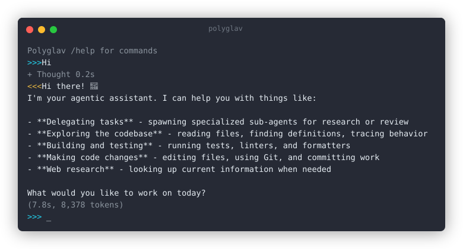

# Polyglav

<p align="center"></p>

**One agent, many heads**

<p>
  <a href="https://pypi.org/project/polyglav/"></a>
  <a href="https://polyglav.github.io/polyglav/"></a>
  =3.10">
  
  
  
</p>

Polyglav is an AI agent that lives in your terminal. You describe an outcome once, it breaks the job into steps, brings in specialist agents for each one, and lets them work through it in order, handing results from one to the next as they finish. You stay at a single prompt the whole time. The name says it: poly means many, glav means heads.

## Why Polyglav

- **One prompt, many heads** - ask for an outcome, and Polyglav splits it across specialists that run one after another in the same process. As soon as one delivers, the next continues. No windows to switch and no babysitting.
- **It actually gets work done** - it reads and writes files, searches the web, runs commands, edits code, and commits, all behind permissions you control.
- **Grows with you** - reusable roles and skills, scheduled jobs that run unattended, and a supervisor for many agents at once.
- **Your machine, your keys** - config and complete session logs stay on your disk. Bring your own provider key, or run fully local.
- **Safe by default** - every tool is permission controlled. Anything outside your project asks first, and every action is on the record.
- **Zero dependencies** - pure Python standard library. Nothing to audit, no supply chain, no lockfile churn.
- **At home in the terminal** - a fast streaming REPL with dimmed thinking, markdown rendering, command completion, and history. No browser and no account.
- **Many providers, any model** - Ollama, OpenAI, Groq, Anthropic, OpenCode Zen/Go, or any OpenAI-compatible endpoint, picked automatically from the address.

## What you can do with it

- **Ship a change end to end** - ask for a feature and let a planner, a programmer, and a reviewer work through it in order.
- **Keep a project tidy** - schedule a job that refreshes docs, updates a changelog, or summarizes logs on a cron.
- **Research and write** - point it at a folder of notes or papers and ask for a summary with sources.
- **Run many agents** - give each folder its own agent and watch them all from one place.
- **Automate with the API** - drive the same loop from scripts, CI, or another program.

## How it works

1. **Ask** - describe an outcome to the assistant in one sentence.
2. **Compose** - for bigger work it designs a small team: the specialists and the order they run in.
3. **Run** - stages run one after another, each with its own tools and permissions.
4. **Hand off** - as the work moves, each agent passes what it did to the next.
5. **Report** - watch progress, jump into any agent, or come back to a summary.

## Install

```bash
pipx install polyglav
polyglav
```

For source installs, the REPL, the headless CLI, the HTTP API, Docker, plugins, and the full command reference, see [INSTALL.md](INSTALL.md).

## Learn more

- [AGENTS.md](AGENTS.md) - architecture and conventions
- [CONTRIBUTING.md](CONTRIBUTING.md) - the contribution workflow
- [INSTALL.md](INSTALL.md) - install, run, and command reference
- [VISION.md](VISION.md) - what Polyglav is and where it is going
- [docs/index.md](docs/index.md) - full documentation

## License

[MIT](LICENSE)
